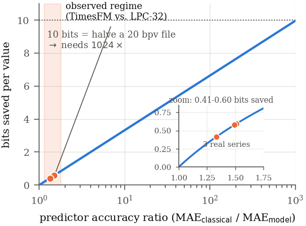
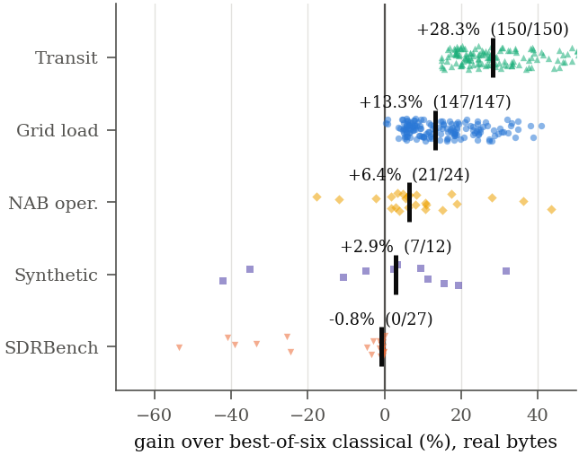
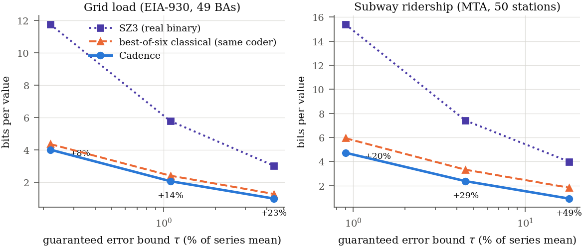
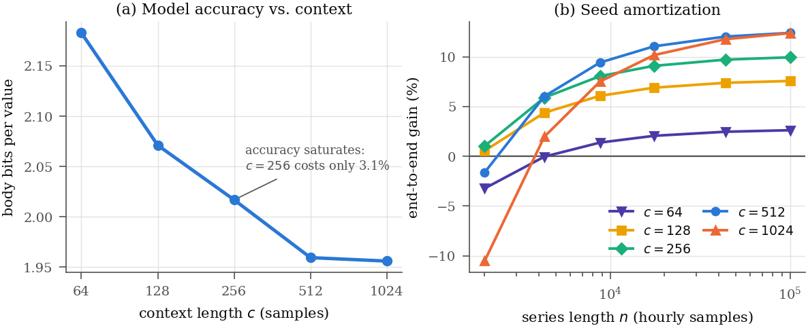

<p align="center">
  
</p>
<p align="center">
  <a href="https://arxiv.org/abs/2609.06008"></a>
</p>

<p align="center">
  <a href="https://arxiv.org/abs/2609.06008">Paper (arXiv)</a> · <a href="REPRODUCE.md">Reproduce Every Number</a> · <a href="results/README.md">Results Manifest</a> · <a href="EXPERIMENTS.md">Experiment Registry</a>
</p>

### Cadence — Error-Bounded Lossy Compression for Demand Time Series

**Cadence** is an **error-bounded lossy** compressor for numeric time series. It uses a time-series foundation model ([TimesFM-3](https://huggingface.co/google/timesfm-3.0-pytorch), 330M parameters) as the predictor inside a closed-loop quantizer, and codes the residual with a purpose-built adaptive arithmetic coder. Every reconstructed sample carries a hard guarantee: `|x̂ − x| ≤ τ`.

On electricity grid demand and subway ridership it beats the best of six classical error-bounded predictors on **297 of 297** series-tolerance pairs, by **+21.4% median**. On scientific simulation data it **loses**. For lossless coding it gains **nothing at all**. This README states where the method works and where it does not, because the boundary *is* the result.

📄 **Paper**: [arXiv:2609.06008](https://arxiv.org/abs/2609.06008) · 📦 Code version: v1.0 · 🔬 40 experiments, 8 retractions — all logged

---

## What This Is, and What It Is Not

| | |
|---|---|
| ✅ **Works** | Aggregate human-demand series — grid load, transit ridership, web traffic — at 1–20% tolerance |
| ✅ **Works** | Long archives where the context bootstrap amortizes (years of hourly data) |
| ❌ **Does not work** | **Lossless** compression. Gains +0.03%. This is structural, not an implementation gap |
| ❌ **Does not work** | Smooth scientific fields (SDRBench: −0.8%, and −46% on a Hurricane ISABEL field) |
| ❌ **Does not work** | Physical sensors, CPU/disk telemetry, random-walk-like financial series |
| ⚠️ **Constraint** | The bitstream is **not portable across devices**. Group size *and* execution device are part of the format |

### Why lossless cannot work — the log₂ law

Code length under a matched residual model is `≈ log₂(residual scale) + c`, so the bits saved by a better predictor are **logarithmic** in the accuracy ratio:

```
Δbits = log₂( MAE_old / MAE_new )
```

TimesFM-3 forecasts real data **1.51× more accurately** than a 32-tap linear predictor — a genuine improvement — which buys **0.60 bits out of 20.28**, or 2.9%. Halving a 20-bit-per-value file would require a **~1000× better** predictor. No forecasting advance closes that gap.



Error-bounded lossy coding escapes this at exactly one point: when the forecast lands **inside** the tolerance band the quantized residual is exactly zero and the sample costs ~0 bits. That is a discontinuity, not a logarithm — and it is the entire basis of the method.

---

## Benchmark Results

All figures are **real bytes**, with every predictor — neural and classical — coded by the same adaptive arithmetic coder. The baseline is the *best of six* classical error-bounded predictors, chosen per row: Lorenzo orders 1–3, a 32-tap LPC, and multilevel linear and cubic interpolation (the predictor family SZ3 actually uses).

| Corpus | Median gain | Wins | Contaminated? |
|--------|-------------|------|---------------|
| SDRBench (scientific) | −0.8% | 0/27 | n/a |
| Synthetic | +2.9% | 7/12 | n/a |
| NAB operational | +6.4% | 21/24 | no |
| **Grid load (EIA-930, 2026)** | **+13.3%** | **147/147** | no |
| **Subway ridership (MTA, 2026)** | **+28.3%** | **150/150** | no |
| **Demand combined** | **+21.4%** | **297/297** | no |



### Grid load — 49 US balancing authorities

| ρ | Median gain | Wins | Classical (bpv) | Cadence (bpv) |
|---|-------------|------|-----------------|---------------|
| 0.01 | +6.4% | 49/49 | 4.356 | **4.009** |
| 0.05 | +13.3% | 49/49 | 2.398 | **2.056** |
| 0.20 | +21.2% | 49/49 | 1.265 | **0.980** |

### Subway ridership — 50 station complexes

| ρ | Median gain | Wins | Classical (bpv) | Cadence (bpv) |
|---|-------------|------|-----------------|---------------|
| 0.01 | +19.9% | 50/50 | 5.942 | **4.734** |
| 0.05 | +27.7% | 50/50 | 3.324 | **2.374** |
| 0.20 | +51.2% | 50/50 | 1.834 | **0.926** |



### Compression ratio vs 32-bit integers

| ρ | Cadence | Classical | Implied relative error |
|---|---------|-----------|------------------------|
| 0.01 | **7.5×** | 5.9× | 0.22% |
| 0.05 | **15.1×** | 12.5× | 1.10% |
| 0.20 | **24.0×** | 20.9× | 4.38% |

### Versus downsampling — what time-series databases actually deploy

Production TSDBs (Prometheus, Thanos, VictoriaMetrics) retain history by **downsampling** to coarse rollups, which has *unbounded* worst-case error: it deletes the spikes that incident analysis needs. At matched file size:

| Corpus | Downsampling's worst-case error, relative to Cadence's guaranteed bound |
|--------|------|
| Grid load | **28×** |
| NAB operational | **37×** |
| Subway ridership | **56×** |

This is the strongest practical case for the method — not competition with scientific compressors, but replacement of lossy retention tiers.

### Key Observations

- **Every one of 297 demand series-tolerance pairs gains.** The 10th percentile still gains 6–9%, so the result is not carried by outliers.
- **Gains grow with tolerance** in both demand corpora (grid: +6.4% → +13.3% → +21.2%), exactly as the zero-residual mechanism predicts.
- The two demand corpora are drawn from **2026 data**, after any plausible TimesFM training cutoff. Wikipedia pageviews — on which TimesFM *was* trained — are included in the repo but excluded from the headline claim.
- **The entropy back end is not neutral.** Replacing xz/zstd with the included arithmetic coder gains **+9.7%** (15/15) and *reversed* one apparent finding. See [Retractions](#retractions).
- **The quantile head is worthless here.** TimesFM-3's nine quantiles add **−13.8%** over using the median alone. Call the model with `return_quantiles=False`.
- Throughput is **45 → 442 values/s** depending on batch, context and precision. This is an archival codec, not a hot-path one.

---

## How It Works

Cadence exploits the same prediction/compression duality as lossless neural compressors, but spends it on an **error bound** rather than on exactness.

### Closed-loop error-bounded quantization

With quantization step `D = 2τ` and predictor `P`:

```
p_t  = P(x̂_{t-c .. t-1})           # predict from the RECONSTRUCTION, never the original
k_t  = round( (x_t - p_t) / D )     # integer residual index
x̂_t  = p_t + k_t · D                # |x̂_t - x_t| ≤ τ by construction
```

Because the predictor is fed its own reconstruction, the decoder can reproduce `p_t` exactly. Only the integers `k_t` are transmitted — and on predictable data most of them are **zero**.

### Compression

```
N series --> code the seed (first c samples) lossily with a classical predictor
          --> for t = c .. n:
                1. TimesFM-3 predicts all N series in ONE batched forward pass
                2. quantize residual to index k_t, reconstruct x̂_t
                3. feed x̂_t back as context
          --> arithmetic-code the index stream (one stream, contexts inside it)
          --> container
```

### Decompression

```
container --> rebuild the seed from its classical predictor
           --> for t = c .. n:
                 1. TimesFM-3 predicts from the SAME reconstructed history
                 2. arithmetic decoder recovers k_t
                 3. x̂_t = p_t + k_t · D  feeds back as context
           --> reconstruction, bit-identical to the encoder's
```

Both sides run the **same model on the same reconstructed history**, so predictions match and the bound holds. Verified by SHA-256 on the full reconstruction.

### The arithmetic coder

`cadence/rangecoder.py` is an LZMA-style adaptive binary range coder with a CABAC-like binarization of signed indices:

| Element | Coding |
|---------|--------|
| zero flag | context-coded (context = recent magnitudes) |
| sign | bypass |
| magnitude prefix | context-coded truncated unary, 6 bins |
| magnitude tail | Exp-Golomb bypass |

Conditioning is expressed as **contexts inside one stream**, never as separate streams. That distinction matters: partitioning the index stream fragments a general-purpose compressor badly enough to invalidate a result — which it did, twice, before we built this.

---

## Installation

### Requirements

- Python 3.10+
- NVIDIA GPU with CUDA (CPU works but is slow; see the portability warning below)
- ~1.3 GB disk for TimesFM-3 weights, ~1.9 GB VRAM at batch 256

### Setup

```bash
git clone https://github.com/robtacconelli/Cadence.git
cd Cadence

python3 -m venv venv
source venv/bin/activate

# install a CUDA-matched torch first if you need a specific build
pip install -r requirements.txt

# fetch corpora (omit sdrb to skip an 8 GB download)
python scripts/fetch_data.py grid transit

# optional: build SZ3 for the external baseline
bash scripts/build_sz3.sh
```

> **Model licence.** This repository is MIT. TimesFM-3 **weights are not**: Google
> releases them under the *TimesFM Non-Commercial License v1.0*, and they are not
> redistributed here. Any use of this pipeline inherits that restriction.

---

## Usage

### Compress a series

```bash
python cli.py compress data.npy out.cdc --rho 0.05
```

`--rho` sets the tolerance as a fraction of each series' standard deviation, so `τ = ρ·σ`. Input is a `.npy` integer array or a `.csv` with one value per line.

### Compress several series as one group

```bash
python cli.py compress MISO.npy ERCO.npy PJM.npy CISO.npy out.cdc --rho 0.05
```

Series in a group are predicted in one batched forward pass, which is where the throughput comes from. **The group size is part of the format** — see [Limitations](#limitations).

### Decompress

```bash
python cli.py decompress out.cdc restored.npy
```

### Inspect a container

```bash
python cli.py info out.cdc
```

### Benchmark the classical predictors

```bash
python cli.py bench data.npy --rho 0.05
```

### Example session

```
$ python cli.py compress data/grid/{MISO,ERCO,PJM,CISO}.npy out.cdc --rho 0.05
Series: 4  length: 900  group: 4
Mode: error-bounded lossy, rho=0.05 (tau = rho * sigma, per series)
Original (int32): 14.1 KB
Compressed:       1.5 KB
Ratio: 0.1088 (10.9%)   9.2x   3.482 bits/value
Time: 35.2s  (44 values/s)
Error bound honoured on every sample (worst = 100.0% of tau)

$ python cli.py info out.cdc
magic      TFMC2
group size 4   (encoder and decoder MUST use this exact batch size)
samples    900 per series, seed 512, context 512
tolerances [396.37 351.99 636.97 119.11]
size       1567 B = 3.482 bits/value

$ python cli.py decompress out.cdc restored.npy
Decompressed: 4 series x 900 samples
Time: 35.5s
sha256(reconstruction): bcf084ffcb415865
```

*(Four EIA-930 balancing authorities truncated to 900 samples, so the run finishes
in about a minute. Throughput here is low because a group of 4 is far below the
batch size at which the model saturates — see [Limitations](#limitations).)*

---

## Reproducing the Paper

`results/*.json` are committed, so **every number in the paper can be verified without a GPU**. Full claim-to-script map in [REPRODUCE.md](REPRODUCE.md).

> ⚠️ `results/` contains output from **three different entropy back ends**, and they
> do not agree — that is the point of retraction R8. [results/README.md](results/README.md)
> labels which files back the paper and which are kept only so the retractions can
> be checked. Read it before quoting any number from that directory.

```bash
make lossless   # the +0.03% null result
make headline   # +21.4% on demand series (needs GPU)
make codec      # bit-exact round trip (needs GPU)
make figures    # regenerate all four figures into assets/ (PNG + PDF)
make verify     # check every paper number against results/ (no GPU)
make check      # compile-check every script
```

### Context ablation



Accuracy saturates early — `c=256` costs only 3.1% against `c=1024` while quartering inference cost — but `c=512` is optimal end-to-end at every archive length, because a shorter bootstrap saves seed bits about as fast as it loses body accuracy.

---

## Container Format

Files use the `.cdc` extension. One format, `TFMC2`:

| Offset | Size | Field | Description |
|--------|------|-------|-------------|
| 0 | 5 B | Magic | `TFMC2` |
| 5 | 32 B | Header | group size `G`, samples `n`, seed length, context `c` (int64 each) |
| 37 | 8·G B | Tolerances | per-series `τ` (float64) |
| variable | per series | Seed block | length, offset, width code, predictor id, count + arithmetic-coded seed indices |
| variable | per series | Body block | length, offset, width code + arithmetic-coded residual indices |

The **seed** is the first `c` samples, coded lossily at the same `τ` by the best of five side-information-free classical predictors (Lorenzo 1–3, interp-linear, interp-cubic), selected per series. TimesFM cannot predict before it has context, and this bootstrap is a real cost that a Lorenzo predictor — which needs one sample — does not pay.

---

## Limitations

- **Throughput.** 224 values/s at fp32, 442 with bf16 autocast. Orders of magnitude slower than classical codecs, which run at MB/s. Decoding is strictly sequential and equally slow. This is an archival codec.
- **Model overhead.** 1.3 GB of weights must be present at both endpoints, under a non-commercial licence.
- **Bitstream is not portable across devices.** TimesFM-3 predictions are *not* bit-identical between GPU and CPU, and no PyTorch configuration we tested fixes it (TF32 off, `use_sdpa=False`, deterministic algorithms, forced MATH backend — all still differ). Expect a desynchronization every **~144k samples** across a device change, and one desynchronization destroys everything after it. fp64 would fix this but the `timesfm` package pins its tensors to fp32.
- **Group size is part of the format.** Batch size changes the numerics, so encoder and decoder must use identical group sizes. Decoding one series costs a full group.
- **Deliverable gain is smaller than the headline.** End-to-end, including the context bootstrap: **+6.8% at six months** of hourly data, +11.0% at one year, +15.1% asymptotically. The +21.4% figure measures the model's predictive advantage, not file size.
- **Two demand domains.** Grid load and transit ridership. The class claim would be stronger with a third (electricity metering, retail transactions).

---

## Retractions

Eight claims in this work were retracted under better measurement. All are logged in [EXPERIMENTS.md](EXPERIMENTS.md) with the experiment that overturned each. Two matter for anyone extending this:

- **R3** — SZ3 carries ~500 B of container overhead that dominates below N≈4k. An early comparison at N=2048 overstated our advantage by a wide margin.
- **R8** — "grid and transit trend oppositely in tolerance" was an artifact of the xz back end, which compresses simple predictors' long zero runs extremely well and so flatters the classical baseline exactly where Cadence should pull ahead. It reversed under a real arithmetic coder. **The retracted version was the more publishable-looking result.**

Every idealized or projected number in this study came in **high** when re-measured as real bytes end-to-end. Treat idealized code lengths as upper bounds only, and treat the entropy back end as part of the experimental design.

---

## Theory

Compression is prediction (Shannon, 1948). For **lossless** coding the connection is tight and the payoff is logarithmic, which is why a 1.5× better forecaster is worth almost nothing (see the log₂ law above). For **error-bounded lossy** coding a second mechanism appears: once the forecast lands inside `[−τ, +τ]`, the residual index is exactly zero and the sample is nearly free. Gains therefore come from *how often the predictor lands in the band*, not from how sharp its distribution is — which is why TimesFM-3's quantile head contributes nothing and only its median matters.

For further reading:

- Shannon, C. E. (1948). *A Mathematical Theory of Communication*
- Das et al. (2024). [A decoder-only foundation model for time-series forecasting](https://arxiv.org/abs/2310.10688) — TimesFM
- Zhao et al. (2021). *Optimizing Error-Bounded Lossy Compression by Dynamic Spline Interpolation*, ICDE — the SZ3 interpolation predictor reimplemented here
- Deletang et al. (2024). [Language Modeling Is Compression](https://arxiv.org/abs/2309.10668), ICLR
- Tacconelli, R. (2026). [Nacrith: Neural Lossless Compression](https://arxiv.org/abs/2602.19626) — the lossless-text counterpart to this work
- Tacconelli, R. (2026). [StateSMix: Online Lossless Compression via Mamba SSMs](https://arxiv.org/abs/2605.02904) — online, CPU-only, no pre-trained weights

---

## Citation

```bibtex
@article{tacconelli2026cadence,
  title   = {Cadence: Error-Bounded Lossy Compression of Demand Time Series
             with a Time-Series Foundation Model},
  author  = {Tacconelli, Roberto},
  journal = {arXiv preprint arXiv:2609.06008},
  year    = {2026},
  url     = {https://arxiv.org/abs/2609.06008}
}
```

---

## License

Code is licensed under the **MIT License**. See [LICENSE](LICENSE).

TimesFM-3 model weights are **not** covered by this licence — they are released by Google under the *TimesFM Non-Commercial License v1.0* and are not redistributed in this repository.
